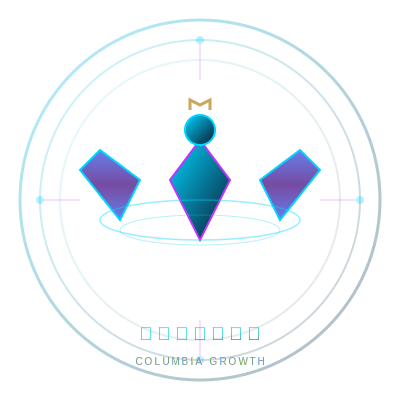

# 🌟 猫猫の成长记录

<div align="center">



**时光不语，成长有迹**

纯 HTML + CSS + JavaScript 打造的成长记录网站

[](https://opensource.org/licenses/MIT)

</div>

---

## 📖 项目介绍

**猫猫の成长记录** 是一个简洁美观的成长记录网站，采用纯 HTML/CSS/JavaScript 开发，无需任何构建工具，直接在浏览器中打开即可使用。

### ✨ 特性亮点

- 🎨 **武陵城风格设计** - 新中式科幻美学，文化底蕴与科技感并存
- 🌈 **四种主题切换** - 温馨治愈 / 简约高级 / 活泼青春 / 科技未来
- 📱 **完全响应式** - 完美适配 PC、平板、手机
- 🎬 **丝滑动画** - PPT 式转场效果，流畅交互体验
- 🚀 **零配置** - 无需安装依赖，双击 HTML 文件即可运行
- 🌐 **GitHub Pages 部署** - 简单快速，免费托管

---

## 🎯 设计理念

### 核心元素
- 🦅 **哥伦比娅神鹰** - Logo 融入安第斯神鹰元素，象征成长与自由
- 🌊 **水主题** - 流动感设计，呼应武陵城水利科技
- ⚙️ **工业美学** - 混凝土质感 + 金属光泽 + 电路纹理
- 🏛️ **传统建筑** - 斗拱飞檐现代化演绎
- 🌸 **自然融合** - 梨花树、竹林、流水等自然元素

---

## 🚀 快速开始

### 方法一：直接打开（推荐）
```bash
# 双击 index.html 文件即可在浏览器中打开
```

### 方法二：本地服务器
```bash
# 使用 Python 快速启动本地服务器
cd 成长
python -m http.server 8000

# 访问 http://localhost:8000
```

### 方法三：使用 VS Code Live Server
1. 安装 VS Code 的 Live Server 插件
2. 右键 index.html → "Open with Live Server"

---

## 📦 部署到 GitHub Pages

### 步骤 1：创建仓库
```bash
# 初始化 Git
git init
git add .
git commit -m "Initial commit: 猫猫の成长记录"
```

### 步骤 2：关联远程仓库
```bash
git remote add origin https://github.com/YOUR_USERNAME/chengzhang.git
git branch -M main
git push -u origin main
```

### 步骤 3：启用 GitHub Pages
1. 进入仓库 Settings → Pages
2. Source 选择 `main` 分支
3. 等待部署完成

### 访问地址
```
https://YOUR_USERNAME.github.io/chengzhang/
```

---

## 🎨 主题切换

点击右上角的彩色圆圈按钮，可切换四种主题：

| 主题 | 风格 | 主色调 |
|------|------|--------|
| 🌸 温馨治愈风 | 温暖亲切 | 粉色 → 橙色渐变 |
| ⚪ 简约高级风 | 极简主义 | 黑白灰 + 金色 |
| 🌈 活泼青春风 | 活力四射 | 多彩渐变 |
| 🚀 科技未来风 | 赛博朋克 | 蓝紫霓虹 |

主题会自动保存在浏览器本地存储中。

---

## 📁 项目结构

```
chengzhang/
├── index.html          # 主页面
├── favicon.svg         # 浏览器图标
├── logo.svg            # Logo
├── README.md           # 项目说明
├── .gitignore          # Git 忽略规则
└── 说明.txt            # 说明文件
```

---

## 🛠️ 自定义内容

### 修改文字
编辑 `index.html` 文件中的文字内容：
- 标题：搜索 "时光不语，成长有迹"
- 关于我：搜索 "关于我" 部分
- 联系方式：搜索页脚部分

### 添加相册
编辑 `index.html` 中的相册部分，复制 `.gallery-item` 块：
```html
<div class="gallery-item">
    <div class="gallery-img"></div>
    <div class="gallery-info">
        <h3>你的标题</h3>
        <p>描述文字</p>
    </div>
</div>
```

### 修改配色
编辑 `index.html` 中的 CSS 变量：
```css
:root {
    --tech-cyan: #00D4FF;
    --neon-purple: #BD34FE;
    /* 修改颜色值 */
}
```

---

##  添加背景音乐（可选）

在 `<body>` 标签后添加：
```html
<audio id="bgm" loop>
    <source src="music/bgm.mp3" type="audio/mpeg">
</audio>
<button onclick="document.getElementById('bgm').play()">播放音乐</button>
```

---

## 📱 响应式支持

网站已完美适配各种设备：
- 📱 手机竖屏
- 📱 平板横屏  
- 💻 桌面显示器

---

## 🤝 贡献指南

欢迎提交 Issue 和 Pull Request！

---

## 📄 许可证

MIT License © 2026 猫猫

---

## 📞 联系方式

- **作者**: 猫猫
- **QQ**: 2973464622
- **邮箱**: 2973464622@qq.com

---

<div align="center">

**Made with ❤️ by 猫猫**

🌊 时光不语，成长有迹 🌊

</div>
